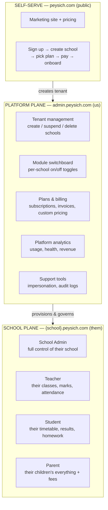
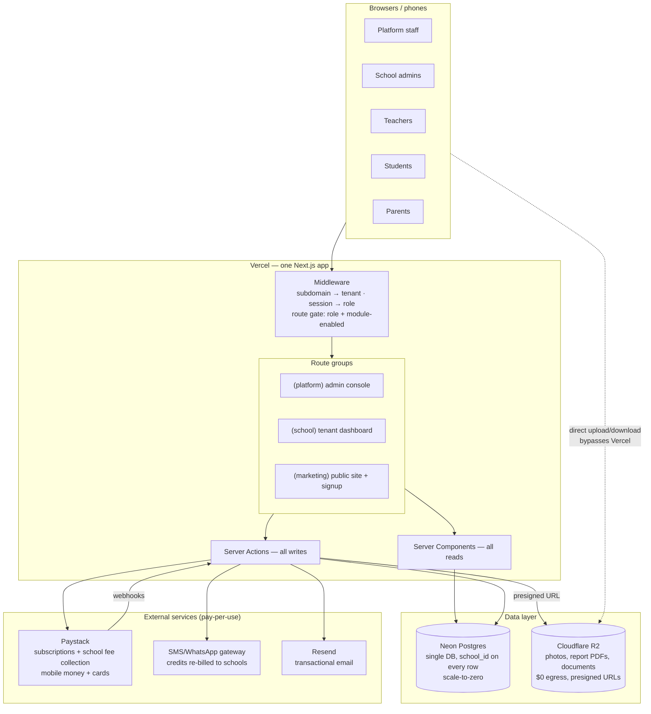

# 00 — The Whole Map

This is the complete picture of what Peysich is, drawn from three inputs:

1. **Your requirements** — multi-tenant, modular with a switchboard, 3 plans + custom, self-serve,
   preschool → JHS only, low-cost at scale, fast, premium shadcn UI, stable/predictable layout.
2. **The video (Lama Dev school dashboard)** — the proven single-school shape: 4 roles
   (admin / teacher / student / parent), role-protected routes via middleware, server components
   for reads + server actions for writes, URL-driven pagination & search, Prisma-style schema
   (teacher, student, parent, grade, class, subject, lesson, exam, assignment, result, attendance,
   event, announcement).
3. **The Gemini conversation** — the cost architecture: Neon Postgres (scale-to-zero),
   Cloudflare R2 with presigned direct upload/download ($0 egress), Vercel for the app,
   SMS re-billed to schools.

We keep what the video proved and **lift it from "one school" to "a platform of schools."**
That lift is the real work, and it touches four things: tenancy, modules, billing, and a control plane.

---

## The two planes

Everything in the system lives in one of two planes:

- **Platform plane** — our internal console. We manage every school from here. This is where the
  switchboard lives: for any school we can flip any module on or off regardless of plan
  (for custom deals, trials, or downgrades).
- **School plane** — what schools buy. Each school is a **tenant**: isolated data, own subdomain,
  own users, and a dashboard that only shows the modules turned on for them.
- **Self-serve funnel** — a school signs up, names their school, picks a plan, pays with
  mobile money / card, and is inside their dashboard in minutes. No sales call required
  (custom plan is the exception — that's a conversation, then we flip switches).

---

## The full system map

Key properties of this map:

- **One deployable.** Platform console, school dashboards, and marketing site are route groups in
  a single Next.js app. One deploy, one bill, shared components. (We can split later if ever needed;
  starting split is cost and complexity for nothing.)
- **Tenant resolution at the edge.** Middleware reads the subdomain → knows the school → loads its
  enabled-module set and the user's role → allows or redirects. This is the video's role-middleware
  pattern, extended with a tenancy + module dimension.
- **Reads are server components, writes are server actions** — exactly the discipline from the video.
  No client-side data fetching layer to build or pay for.
- **Files never touch Vercel.** Browser ⇄ R2 directly via presigned URLs. This is the single biggest
  cost guardrail from the Gemini conversation and we bake it in from day one.

---

## Target market shape (preschool → JHS, Ghana-first)

This defines what the academic modules must model:

- **Levels:** Creche / Nursery / KG1–KG2 / Basic 1–6 (Primary) / Basic 7–9 (JHS).
  A school configures which levels it runs — a standalone preschool and a full basic school
  both fit the same structure.
- **Academic calendar:** configurable **terms or semesters** per academic year (GES has changed
  this before; we do not hardcode 3 terms).
- **Assessment:** continuous assessment + exams with configurable weights
  (e.g. the common 50% class score / 50% exam split), grade bands, and terminal report cards.
  JHS needs BECE-oriented record keeping. Preschool needs skills/domain-based reports
  (not numeric scores) — this is a mode of the assessment module, not a separate module.
- **Payments reality:** mobile money first. Parents pay fees via MoMo; schools pay us via MoMo or card.
- **Connectivity reality:** school offices may have weak internet. The app must be light —
  server-rendered pages, small payloads, aggressive caching — which conveniently is also
  what keeps our infra bill flat.

---

## What "modular" means here (summary — full detail in doc 03)

A **module** is a self-contained folder: its routes, its nav entries, its permissions, its DB tables,
its plan requirements — all declared in one manifest. The app composes itself from the registry of
manifests:

- **Dev point of view:** adding a module = adding a folder + registering its manifest.
  Removing one = deleting the folder. No scattered edits.
- **Sales point of view:** every module has a key (`attendance`, `fees`, `timetable`…).
  Plans are just named bundles of module keys. The switchboard edits a school's set directly.
- **Runtime:** nav, routes, dashboards, and even DB queries check one thing:
  `isEnabled(schoolId, moduleKey)`. Off means invisible — not greyed out, gone.

---

## The economics in one line (full detail in doc 07)

Infra is ~$0 during build, **under ~$50/mo at 10–20 schools, under ~$150/mo at 50 schools**, while
revenue scales per school — so gross margin sits at 85–94% once past the first handful of schools.
Every architecture choice in these docs was screened against that curve.
