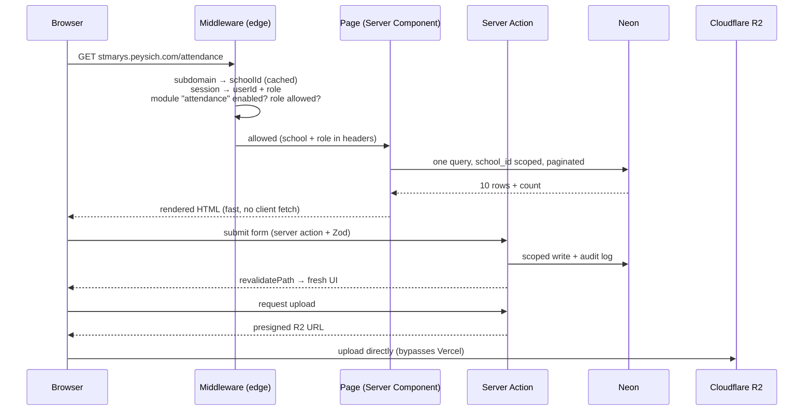

# 01 — Architecture & Stack

Every choice below was screened against four tests: **cheap at scale**, **fast**, **modular-friendly**,
**boring/proven** (no exotic tech we'll fight later).

## The stack

| Layer | Choice | Why | Monthly cost trajectory |
|---|---|---|---|
| Framework | **Next.js (App Router) + TypeScript** | Server components for reads, server actions for writes (the video's proven pattern); one app hosts all three planes | $0 (OSS) |
| Hosting | **Vercel** (Hobby → Pro $20) | Zero-ops serverless; school traffic is light JSON, well within Pro limits when files bypass it | $0 → $20 |
| Database | **Neon Postgres** | Scale-to-zero fits school hours (nights/weekends/holidays idle); branching gives free staging DBs | $0 → ~$25 at 20 schools |
| ORM | **Drizzle ORM** *(recommended — decision #2)* | SQL-shaped, tiny runtime, fastest cold starts on serverless, first-class RLS support; Prisma is the video's choice and fine, but heavier per-invocation | $0 |
| Auth | **Better Auth** *(recommended — decision #1)* | Self-hosted in our own Postgres → **$0 forever, any user count**. Email/password **+ Google sign-in** (built-in social provider; needs a free Google OAuth client — see HANDOFF.md). Per-MAU vendors (Clerk) break our margin: 20 schools ≈ 15–25k MAUs ≈ $100–$300/mo for something we can own | $0 |
| File storage | **Cloudflare R2** | $0 egress; presigned direct upload/download keeps Vercel bill flat | $0 → ~$5 |
| Payments | **Paystack** *(recommended — decision #3)* | Mobile money + cards in Ghana; subscriptions API; also usable later for schools collecting fees from parents | % per transaction only |
| Email | **Resend** | 3k emails/mo free; transactional only (invites, receipts, resets) | $0 → $20 |
| SMS/WhatsApp | Local gateway (e.g. Arkesel/Hubtel) | Prepaid credits **re-billed to schools with 20–30% markup** — never our cost | $0 net |
| UI | **shadcn/ui + Tailwind**, morphed to a Peysich theme | You own the components (copy-in, not a dependency) — morphing to premium is just tokens + refinement | $0 |
| Validation | **Zod** shared schemas | Same schema validates react-hook-form client-side and server actions server-side — one source of truth | $0 |
| Cache/queue | **Postgres-first** (no Redis) | At our scale Postgres handles queues (`FOR UPDATE SKIP LOCKED`), counters, and caching; Vercel Cron for scheduled jobs. Add Redis only when measured need appears | $0 |

## How a request flows



## Repository shape (single app, module-first)

```
peysich/
├── app/
│   ├── (marketing)/          # peysich.com — landing, pricing, signup
│   ├── (platform)/           # admin.peysich.com — our console
│   └── (school)/             # {school}.peysich.com — tenant dashboards
│       └── [module routes composed from src/modules/*]
├── src/
│   ├── modules/              # ⭐ the product lives here (see doc 03)
│   │   ├── students/         #   each: manifest, routes, components,
│   │   ├── attendance/       #   actions, queries, schema
│   │   ├── fees/
│   │   └── ...
│   ├── core/                 # tenancy, auth, entitlements, rbac, audit
│   ├── db/                   # drizzle schema (core) + client + migrations
│   ├── ui/                   # morphed shadcn components + layout shells
│   └── lib/                  # utils, zod helpers, r2, paystack, sms
└── docs/
```

One deployable. Route groups map to the three planes; middleware routes subdomains into the right group.

## Performance rules (non-negotiable, enforced in review)

1. **Every table query is paginated server-side** (`take`/`skip` from URL params — the video's
   pattern) and **selects only displayed columns** (no `include`-everything).
2. **Every query filters by `school_id` first** and every hot path has a composite index
   starting with `school_id` (see doc 02 & 05).
3. **One round trip per page**: batch count+data in one transaction; never waterfall queries
   in nested components.
4. **Files never proxy through the app** — presigned R2 both directions.
5. **Static where possible**: marketing site fully static; school dashboards dynamic but with
   `revalidate`d shared lookups (terms, classes, module set).
6. **Cold-start budget**: keep server bundle lean (Drizzle helps); no heavyweight deps in
   middleware.

## Environments

- **Local**: Docker Postgres (as in the video) or a Neon branch.
- **Preview**: every PR → Vercel preview + Neon branch (free, instant, real data-shape testing).
- **Production**: `main` → Vercel prod + Neon main.
- Migrations run via CI step on merge (drizzle-kit), never by hand against prod.
