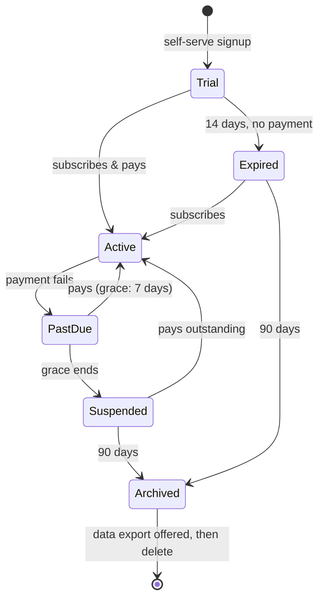

# 02 — Multi-Tenancy

## The model: shared database, shared schema, `school_id` on every row

Three standard options were weighed:

| Model | Isolation | Cost at 50 schools | Ops burden | Verdict |
|---|---|---|---|---|
| Database per school | Strongest | ~50 Neon projects/branches to migrate, monitor, pay for | Heavy | ❌ kills the cost curve and the "self-serve in minutes" flow |
| Schema per school | Strong | One DB but 50 schemas × every migration | Medium-heavy | ❌ migration pain grows linearly with sales success |
| **Shared schema + `school_id` column** | Logical (enforced in code + RLS) | **One database, flat cost** | Light | ✅ chosen |

Shared-schema is what virtually every SaaS at our price point runs. Isolation is enforced by
**three layers**, so a single mistake cannot leak data across schools:

1. **Tenant context, resolved once.** Middleware maps subdomain → `schoolId`, verifies the session
   user belongs to that school, and stamps the request. No handler ever takes `schoolId` from user input.
2. **Scoped data access.** All queries go through a per-request repository that injects
   `WHERE school_id = ?` automatically. Writing a raw unscoped query on tenant tables is a lint error.
3. **Postgres Row-Level Security as the backstop.** RLS policies on every tenant table check
   `school_id = current_setting('app.school_id')`. Even a buggy query returns nothing cross-tenant.
   (This is the layer that lets us sell "bank-grade isolation" honestly.)

Platform-plane tables (tenants, plans, subscriptions, platform users) have **no** `school_id` —
they live above tenants and are reachable only from `(platform)` routes.

## Tenant identity & URLs

- **Each school gets a subdomain**: `stmarys.peysich.com` *(decision #4 — recommended over path-based)*.
  - Feels owned/premium to the school; clean cookie + auth scoping; one wildcard DNS record on Vercel.
  - Slug chosen at signup, changeable once via support.
- `admin.peysich.com` → platform plane. `peysich.com` / `www` → marketing + signup.
- Custom domains (`portal.stmarys.edu.gh`) become a **premium/custom plan perk** later — Vercel
  supports it natively.

## The tenant lifecycle

- **Trial**: full Standard-plan features, capped (e.g. 50 students) — enough to feel it, not run on it.
- **Suspended**: read-only lock, not deletion. Admins see a "settle payment" wall; data intact.
  Schools mistrust systems that can vanish their records — we never hard-delete on payment failure.
- **Archived → delete**: export (CSV/PDF bundle) offered before any destruction. Deletion is a
  platform-plane action with confirmation, never automatic without notice.

## What the platform plane manages (our console)

| Area | Capabilities |
|---|---|
| Tenants | Create (or approve), view, suspend/reactivate, archive, slug/domain management |
| Switchboard | Per-school module toggles (plan defaults + per-school overrides), limits (student caps), trial extensions |
| Billing | Plans, prices, custom-plan composer (pick modules → set price), invoices, payment history, dunning status |
| Users | Platform staff accounts & roles (owner, support); **impersonate school admin** (audited, visible banner) |
| Health | Per-tenant usage (students, storage, SMS credits), error rates, slow queries, activity |
| Audit | Every platform action logged: who, what, which tenant, when |

## Onboarding flow (self-serve, target < 10 minutes to usable)

1. Sign up (name, email/phone, password) → verify.
2. Create school: name, slug, levels offered (creche → JHS9), academic year + term dates.
3. Pick plan → pay via Paystack (or start trial).
4. Guided setup checklist inside the dashboard: add classes → add staff (bulk invite) →
   add students (CSV import or forms) → link parents.
5. Switchboard auto-provisions the plan's modules; dashboard composes itself accordingly.

CSV import for students/staff is **first-class from day one** — it is the single biggest
onboarding friction for real schools, and doing it well is a sales weapon.

## Cross-tenant safety rules (enforced, not aspirational)

- Uploaded files are keyed `school/{schoolId}/...` in R2; presigned URLs are generated only after
  a tenant-scoped permission check.
- Search, exports, and reports run through the same scoped repository — no side doors.
- Per-tenant rate limits on writes and SMS sends so one school can't degrade others.
- Backups: Neon PITR covers disasters; per-tenant export covers "school leaves" cleanly.
