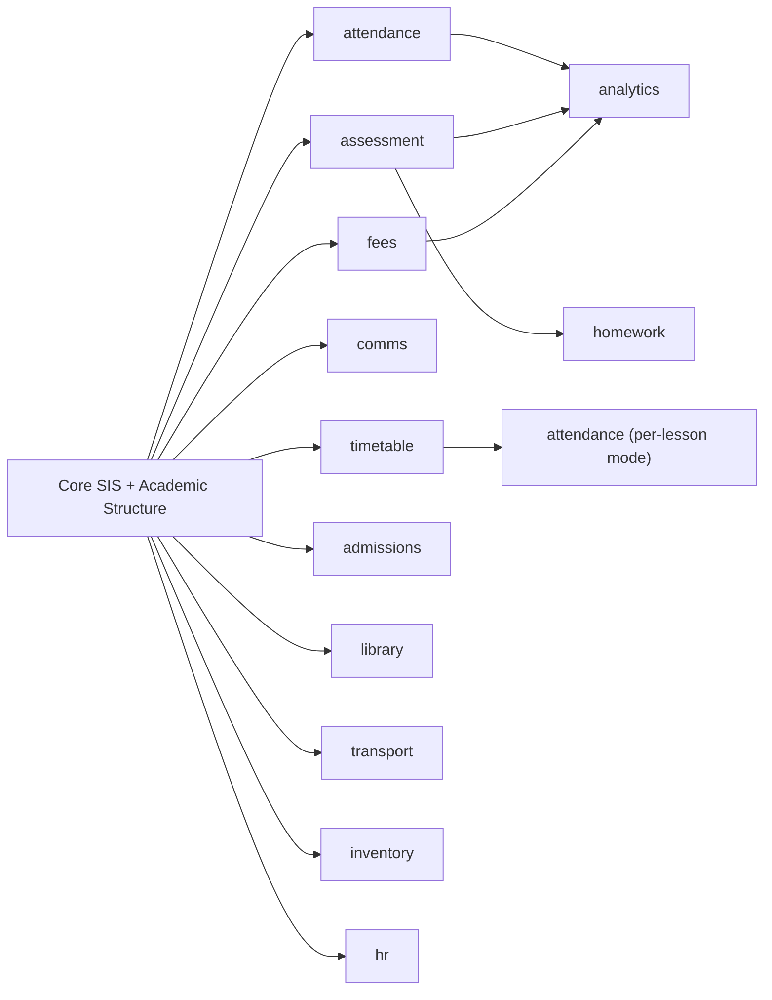

# 03 — The Module System & Switchboard

Modularity is the core product bet: **modules are the unit of development AND the unit of sales.**
One mechanism serves both.

## What a module is (dev view)

A self-contained folder with a manifest. Nothing about a module leaks into shared code except
its registration line.

```
src/modules/attendance/
├── manifest.ts        # identity, nav, permissions, plan info, dependencies
├── routes/            # pages mounted under (school)/attendance/*
├── components/        # module-only UI
├── actions.ts         # server actions (writes)
├── queries.ts         # scoped reads
└── schema.ts          # this module's DB tables (drizzle)
```

```ts
// manifest.ts — the single source of truth for this module
export const attendanceModule: ModuleManifest = {
  key: "attendance",
  name: "Attendance",
  description: "Daily & per-lesson attendance with parent alerts",
  icon: CalendarCheck,
  nav: [{ label: "Attendance", href: "/attendance", roles: ["admin", "teacher"] }],
  permissions: ["attendance.view", "attendance.mark", "attendance.report"],
  dependsOn: ["core"],           // can't enable without core SIS
  dashboardWidgets: [AttendanceTodayWidget],   // slots into role dashboards when enabled
};
```

**Adding a module** = create the folder + one line in `src/modules/registry.ts`.
**Removing a module** = delete the folder + that line. No hunting through nav files, dashboards,
or permission lists — they all read the registry.

## How enablement works (runtime)

One function answers everything: `isEnabled(schoolId, moduleKey)`.

```
effective modules for a school =
    plan's module set
  + platform overrides (switchboard: force-on / force-off)
  − modules whose dependencies are unmet
```

Enforced at **four layers**, so "off" truly means gone:

1. **Nav** — sidebar composes only from enabled manifests. No greyed-out upsell clutter
   (the school admin's Billing page shows what upgrading unlocks instead).
2. **Middleware** — hitting a disabled module's URL redirects to the dashboard, same as the
   video's role gate. Role check and module check happen together.
3. **Server actions** — every action asserts module + permission before writing
   (defense against forged requests).
4. **Dashboard widgets** — role dashboards render only enabled modules' widgets.

The effective-module set is cached per school (revalidated on any switchboard/plan change),
so the check costs nothing per request.

## The switchboard (platform plane)

A per-school control panel: every module as a three-state switch —
**Plan default / Force ON / Force OFF** — plus limits (max students, storage, SMS credit balance).
Every flip is audited (who, when, old→new). This is how we do custom deals, trials of a single
module ("try Fees free this term"), and graceful downgrades — without code changes or redeploys.

**Disabling never deletes data.** Turn Fees off and back on next term — everything is still there.
Module data is only removed with tenant deletion.

## The full module catalog

### Core (always on — not sellable separately, the foundation)

| Module | Contents |
|---|---|
| **SIS (Students & People)** | Student profiles & photos, guardians/parents linking, staff/teacher profiles, enrolment history, ID numbers |
| **Academic Structure** | Levels (Creche→JHS9), classes/streams, subjects, academic years & terms, promotion between years |
| **Users, Roles & Auth** | Admin-created accounts (no self-signup inside a school — the video's model), roles & permissions, bulk invites |
| **Settings & Branding** | School profile, logo, term dates, grading scheme config, notification preferences |

### Sellable modules (the switchboard's switches)

| Key | Module | What it does | Tier* |
|---|---|---|---|
| `attendance` | Attendance | Daily register and/or per-lesson marking, reports, absence alerts to parents | Starter |
| `assessment` | Exams & Report Cards | Continuous assessment + exams, configurable weights (e.g. 50/50), grade bands, terminal report cards (PDF to R2), **preschool skills-based mode**, BECE-oriented JHS records | Starter |
| `timetable` | Timetable | Lesson scheduling per class/teacher/subject, clash detection, teacher & student views | Standard |
| `homework` | Homework & Assignments | Assignments with due dates, submissions (files→R2), marking → feeds assessment | Standard |
| `fees` | Fees & Billing | Fee structures per level/term, invoices, **parent payment via mobile money (Paystack)**, receipts, arrears tracking, defaulters report | Standard |
| `comms` | Communication | Announcements & events (school-wide or per-class — the video's model), SMS/WhatsApp blasts (prepaid credits), parent messaging | Starter (announcements) / Standard (SMS) |
| `admissions` | Admissions | Online application form, applicant pipeline, convert applicant→student | Premium |
| `library` | Library | Catalogue, lending, returns, fines | Premium |
| `transport` | Transport | Routes, vehicles, student-route assignment, pickup lists | Premium |
| `inventory` | Inventory & Assets | School property, supplies, assignment to rooms/staff | Premium |
| `hr` | Staff HR & Payroll-lite | Leave tracking, payroll register (records, not money movement) | Premium |
| `analytics` | Advanced Analytics | Cross-term performance trends, attendance heatmaps, fee-collection analytics | Premium |

\* "Tier" = which plan includes it by default; the switchboard can override anything per school.

### Explicitly out of scope (v1–v2)

E-learning/LMS content delivery, CCTV/biometrics integrations, accounting general ledger,
SHS/university structures (grading, credit systems). These are distractions from the core sale.

## Module dependency map



Dependencies are declared in manifests and enforced by the switchboard UI
(can't force-on `analytics` without its inputs; turning off `assessment` warns about `homework`).
