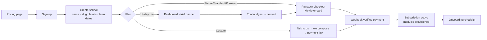

# 04 — Plans, Pricing & Self-Serve Billing

## The three plans + Custom

Plans are **named bundles of module keys + limits**, stored as data (rows), not code.
Changing what a plan includes is a platform-console edit, effective immediately for new signups.

| | **Starter** | **Standard** ⭐ | **Premium** | **Custom** |
|---|---|---|---|---|
| Pitch | "Run your records digitally" | "Run your whole school" | "Everything, plus insight" | "Exactly what you need" |
| Core SIS + structure | ✅ | ✅ | ✅ | ✅ |
| Attendance | ✅ | ✅ | ✅ | pick |
| Exams & report cards | ✅ | ✅ | ✅ | pick |
| Announcements & events | ✅ | ✅ | ✅ | pick |
| Timetable | — | ✅ | ✅ | pick |
| Homework | — | ✅ | ✅ | pick |
| Fees (MoMo collection) | — | ✅ | ✅ | pick |
| SMS/WhatsApp blasts | — | ✅ (credits) | ✅ (credits) | pick |
| Admissions, Library, Transport, Inventory, HR | — | — | ✅ | pick |
| Advanced analytics | — | — | ✅ | pick |
| Student cap | 200 | 600 | unlimited | negotiated |
| Storage cap | 2 GB | 10 GB | 50 GB | negotiated |
| Custom domain | — | — | ✅ | pick |
| Support | email | email + WhatsApp | priority | dedicated |

**Indicative pricing** (final numbers are a business call, not an architecture one — decision #6):

- Anchor on **per-term billing** — schools budget by term, and money arrives at term start when
  school fees come in. Monthly and annual (discounted) also offered.
- Working hypothesis from the Gemini analysis: Starter ≈ GHS 300–450/term, Standard ≈ GHS 750–1,200/term,
  Premium ≈ GHS 1,500–2,500/term, tuned per market. Optional per-student pricing
  (GHS 15–30/student/term) can be modeled later as a plan variant — the billing engine supports
  flat-per-period from day one, per-student as a fast follow.
- **One-time onboarding fee** (GHS 500–1,500) for schools wanting us to do data migration —
  pure-margin service revenue, optional for self-serve schools.

**Custom** = we compose a module set + limits in the platform console, set a price, and send a
payment link. Same billing engine, hand-set inputs.

## Self-serve subscription flow

Everything a school needs is inside their **Billing** page: current plan, what each upgrade
unlocks (this is where upsell lives — not greyed-out nav), invoices/receipts, payment method,
SMS credit top-ups, upgrade/downgrade/cancel. No emails to us required.

## Billing engine rules

- **Source of truth is our DB**, synced from Paystack webhooks (`charge.success`,
  `subscription.disable`, etc.). Webhook handlers are idempotent; a reconciliation cron
  re-checks Paystack daily so a missed webhook can't strand a school.
- **Upgrades**: immediate module unlock, prorated charge (or charge at next term for per-term billing — simplest honest rule: upgrade now, pay difference now).
- **Downgrades**: take effect at period end; modules turn off but **data is never deleted**.
- **Dunning**: payment fails → PastDue (7-day grace, in-app + SMS/email reminders) → Suspended
  (read-only wall). Detailed states in doc 02.
- **Currency**: GHS first; multi-currency is a column, not a rewrite, when we expand.
- **SMS credits**: prepaid wallet per school, topped up via Paystack, debited per send with
  20–30% margin baked into bundle pricing. Our gateway bill is always covered by wallets already paid.

## Two money flows, kept strictly separate

1. **Subscription revenue** (school → us): Paystack subscriptions/invoices as above.
2. **School fees collection** (parent → school, via the Fees module): Paystack **subaccounts/split
   payments** so parent money settles to the *school's* account, never pooled through ours —
   we are software, not a money custodian (avoids licensing exposure). We may take a small
   convenience margin on top of gateway fees later; architecture supports it via split config.
