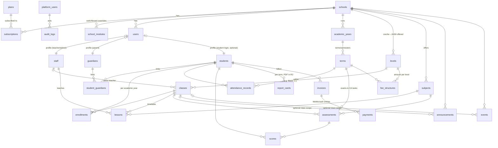

# 05 — Data Model

The video's schema (teacher, student, parent, grade, class, subject, lesson, exam, assignment,
result, attendance, event, announcement) is the proven single-school core. We keep its
relationships and make four structural upgrades:

1. **`school_id` on every tenant table** (+ RLS) — the multi-tenancy dimension.
2. **A unified `users` table** — the video has separate Admin/Teacher/Student/Parent tables each
   carrying auth identity. We split **identity** (users: login, role) from **profile**
   (staff/students/guardians), because one person can be a teacher *and* a parent,
   and platform staff aren't school people at all.
3. **Time is first-class** — `academic_years` and `terms` tables; enrolment, marks, fees, and
   attendance all hang off a term. The video hardcodes "now"; real schools need history,
   promotion, and per-term reports.
4. **Assessment is configurable** — grade bands and CA/exam weights per school (50/50 default),
   plus a skills-based mode for preschool, instead of a bare `result.score`.

## Entity map

## Table groups & ownership

| Group | Tables | Owned by |
|---|---|---|
| Platform | `schools, plans, subscriptions, invoices_platform, school_modules, platform_users, audit_logs_platform, sms_wallets` | core (platform plane) |
| Identity | `users, sessions, staff, students, guardians, student_guardians` | core |
| Structure | `academic_years, terms, levels, classes, subjects, enrollments` | core |
| Attendance | `attendance_records` | `attendance` module |
| Assessment | `grading_schemes, grade_bands, assessments, scores, skill_domains, skill_ratings, report_cards` | `assessment` module |
| Timetable | `lessons, rooms` | `timetable` module |
| Homework | `assignments, submissions` | `homework` module |
| Fees | `fee_structures, fee_items, invoices, payments` | `fees` module |
| Comms | `announcements, events, messages, sms_log` | `comms` module |
| Files | `files (R2 key, owner, school, size, kind)` | core |
| Audit | `audit_logs (school-level: who did what)` | core |

Module tables live in the module's own `schema.ts` — deleting a module removes its schema from
the codebase; existing data is dropped only by an explicit migration (sales-safe by default).

## Design details that matter

- **Roles**: `users.role ∈ {admin, teacher, student, parent}` per school (video's four), plus
  fine-grained permissions per module for staff variations (bursar = admin limited to `fees.*`).
  One phone/email can hold multiple user rows across schools — or two roles in one school —
  disambiguated at login.
- **Student logins are optional.** Preschool/primary kids don't log in; parents are the real
  consumer of "student" screens. JHS students can be issued accounts. This is a per-school setting.
- **Promotion**: end of year, bulk-promote enrolments to the next level's classes
  (wizard, per-student exceptions). History stays: last year's enrolment row, scores, and reports
  are immutable records.
- **Preschool assessment mode**: `skill_domains` (e.g. "Language & Literacy") with
  `skill_ratings` (emerging/developing/secure) replace numeric scores; the report card
  template switches on the level. Same module, two modes.
- **Attendance modes**: daily register (primary/preschool) or per-lesson (JHS, needs timetable) —
  per-school or per-level setting.
- **Money is integers** (pesewas), never floats. All timestamps UTC, displayed in Africa/Accra.
- **Soft deletes** (`deleted_at`) for people and financial records; hard delete only via
  platform-plane tenant deletion.
- **IDs**: UUIDv7 everywhere (sortable, no cross-tenant guessing, merge-safe for imports).

## Indexing rules (the speed contract)

- Every tenant table: composite indexes **starting with `school_id`**, e.g.
  `(school_id, class_id, date)` on attendance, `(school_id, student_id, term_id)` on scores,
  `(school_id, status, due_date)` on invoices.
- Text search (student/staff name lookups) via Postgres `pg_trgm` index — the video's
  `contains/insensitive` search stays fast at 100k+ students without extra services.
- List pages always query `(data, count)` in one transaction (video's `$transaction` pattern).
