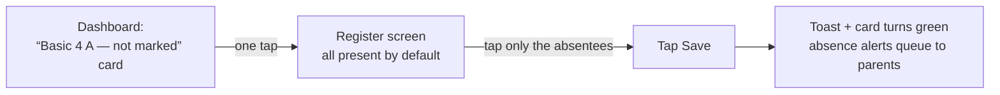
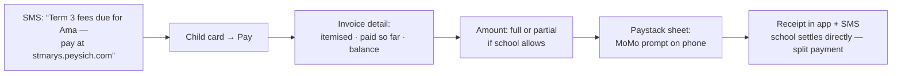

# 10 — Role Flows: What Each Person Does, and How

The four school-plane roles from doc 00, taken from "who logs in" down to "what they do on a
Tuesday morning." Each section covers: who this person really is, their rhythm in the app,
their processes step-by-step (with the exact pages touched), and the **page fine-tuning notes**
— the design consequences that make each screen genuinely valuable to that person instead of
just a CRUD table.

A rule that shaped everything below: **value = the app fits the person's real rhythm.**
Teachers live in minutes between lessons; admins live in term cycles; parents live in
"is my child okay and what do I owe"; students (JHS only) live in "what's due." Pages are tuned
to those rhythms, not to our database shape.

---

## Quick map: who does what

| Process | Admin | Teacher | Parent | Student (JHS) |
|---|---|---|---|---|
| Set up school, terms, classes | **owns** | — | — | — |
| Enrol students / staff | **owns** | — | — | — |
| Mark attendance | monitors | **owns** | views child | views own |
| Enter scores / marks | monitors | **owns** | views child | views own |
| Generate report cards | **owns** (publish) | contributes | downloads | views |
| Set homework | — | **owns** | monitors | **does** |
| Fees: structure & invoices | **owns** | — | **pays** | — |
| Announcements / events / SMS | **owns** | class-scoped | receives | receives |
| Timetable | **owns** | views own | views child's | views own |
| Promotion to next year | **owns** | — | — | — |

---

## 1 · School Admin (head teacher / proprietor / bursar)

**Who:** the buyer and power user. Often the proprietor or head teacher; in bigger schools an
office administrator and a bursar (same role, permission-scoped to `fees.*`). Desktop-first,
moderate computer literacy, deeply allergic to losing records. Their trust decides renewal.

**Their rhythm:**

| Cadence | What they do |
|---|---|
| Once (setup) | Configure school, levels, terms, classes, subjects; import people |
| Daily | Glance dashboard: attendance today, fees trickling in, anything unusual |
| Weekly | Chase absences and fee arrears; post announcements; approve/fix records |
| Termly | Open term → set fee structure → mid-term checks → close term → **publish report cards** → collect next term's fees |
| Yearly | Promote students, archive year, re-enrol, staff changes |

### Flow A — First-time setup (the make-or-break hour)


Step by step in the app:
1. Lands on an **empty dashboard that is a checklist**, not a blank grid — five numbered cards,
   each opening the right settings page, each turning green when done.
2. **Settings → School profile**: name, logo (R2 upload), levels run (tick Creche…JHS 3),
   academic year + term dates.
3. **Settings → Classes**: we pre-generate one class per ticked level ("Basic 1 A") — admin renames,
   duplicates for streams, assigns class teachers. Editing a suggestion is 10× faster than
   creating from nothing.
4. **Settings → Subjects**: pre-seeded GES-typical subject list per level band; admin prunes.
5. **Staff page → Invite**: paste emails/phones, pick role, send. Invitees set their own password.
6. **Students page → Import CSV**: download our template → upload → column-mapping screen with
   live preview → error report per row (fix in place or skip) → import. Guardian columns
   auto-create linked parent accounts (invited by SMS).

**Page fine-tuning notes:**
- The checklist dashboard is the onboarding — no separate wizard to abandon.
- Every list page seeds from templates where GES structure is predictable. Blank-slate cost is real.
- CSV import must survive messy files: encoding, blank rows, duplicate names → clear per-row
  errors, never a silent partial import.

### Flow B — A normal morning (the 90-second check)

Dashboard answers, in order, without a single click: **attendance marked yet? who's absent a lot?
money in today? anything pending?** Widgets: attendance-today bar per class (grey = teacher hasn't
marked — one click nudges that teacher), fees collected this week vs outstanding, latest payments,
upcoming events, pending items (unapproved results, unread messages).

**Fine-tuning:** every dashboard number is a link into the pre-filtered list behind it
(the video's shortcut-with-query-params pattern — "12 absent today" → attendance list already
filtered to today+absent). Numbers that go nowhere are decoration.

### Flow C — Termly cycle (where the real value is proven)

1. **Open term** (Settings → Academic years): dates auto-rolled from calendar, one confirm.
2. **Fees → Fee structure**: set per-level items (tuition, feeding, PTA…) → generate invoices
   for all enrolled students in one action → parents notified automatically.
3. **Mid-term**: Fees → Defaulters report (filter by class, amount, days overdue) → select rows →
   send reminder SMS batch (wallet debited, preview shown with cost before send).
4. **End of term**: Assessment → Term closing screen — a matrix of class × subject showing score
   entry completeness (green/amber/red). Admin chases red cells (one-click nudge to the teacher),
   then **Review → Publish report cards**: batch-generates PDFs to R2, flips them visible to
   parents, optional SMS "report ready" blast.
5. **Close term**: locks score editing (audited unlock available — mistakes happen).

**Fine-tuning:**
- The **completeness matrix** is the killer admin screen at term end — nobody publishes reports
  chasing teachers by phone. It's just an aggregate over `scores`, cheap to build, huge value.
- Publishing is explicit and reversible-before-visible: preview any card → publish all →
  parents see them. Never auto-publish.
- Every bulk action (invoices, SMS, publish) shows scope + cost before confirm:
  "Generate 412 invoices totalling GHS 61,800?"

### Flow D — Year end: promotion

Promotion wizard (Settings → Academic years → Promote): pick source year → mapping screen
"Basic 1 A → Basic 2 A" pre-filled from level order → per-student exceptions (repeat, transfer out,
graduate JHS 3) → confirm → new enrolments created, history untouched. Graduates move to an
alumni state, records intact.

---

## 2 · Teacher

**Who:** the daily heartbeat. Phone-first (often only device), 5-minute windows between lessons,
zero patience for clicks. If teachers hate the app, the school churns — **speed of entry is the
entire design brief.**

**Their rhythm:**

| Cadence | What they do |
|---|---|
| Daily | Mark attendance (register or per-lesson), check today's timetable |
| Weekly | Set/mark homework, post class announcements |
| Continuous | Enter CA scores as tests/exercises happen |
| End of term | Enter exam scores, write remarks, confirm completeness |

### Flow A — Marking attendance (the most-repeated action in the whole product)



In the app: dashboard leads with **today's classes as cards**, each showing marked/unmarked.
Tap → full class list, **every student defaulted to Present**, photo + name per row, whole row is
the tap target toggling Present → Absent → Late. Mark the 3 absentees, Save. Under 30 seconds
for 40 kids.

**Fine-tuning:**
- Default-present is the whole game — teachers mark exceptions, not the roll.
- Row = button (thumb-sized), photos for young classes where names are still fuzzy.
- Save is idempotent and editable until the school's cutoff time (admin setting); after that,
  edits go through admin (audit trail).
- Slow connectivity: the register is one small page, submits one small action — usable on 2G.

### Flow B — Entering scores (the term's biggest data-entry job)

In the app: **Assessment → my class-subjects** (only theirs — the video's role-scoping) → pick
"Basic 4 A · Maths" → assessment list for the term (CA tasks + exam, weights shown) → pick one →
**the score sheet**: students down, one score column, keyboard-first — type, `Enter`, next row.
Out-of-range rejected inline. Autosaves per row. A running completeness count ("31/40 entered")
mirrors what the admin's matrix sees.

**Fine-tuning:**
- This page is tuned like a spreadsheet, not a form: no dialogs per student, no mouse required,
  paste-a-column supported later.
- Preschool teachers get the skills-rating variant: student down, domains across,
  tap-cycle emerging/developing/secure — same screen skeleton, different cell widget.
- Remarks: per-student free text with a phrase bank ("shows great improvement in…") — remarks are
  the most-procrastinated field; lowering their cost gets reports out on time.

### Flow C — Homework

Assignments → New: class-subject, title, instructions, due date, optional attachment (R2).
Students/parents notified. Submissions land in a list (submitted/late/missing tabs); teacher marks
inline (same score-sheet pattern) and marks feed CA automatically if the assignment is flagged
as assessed.

### Flow D — What a teacher can see (and not)

Their classes' student profiles (contact, guardian, attendance/results history), their own
timetable, class-scoped announcements they can post. Not: other classes' data, fees (beyond an
admin-set flag like "fee-blocked from exams" if the school enables it), other teachers' scores.
The module/role gate (doc 03) makes all of this absence-of-nav, not error pages.

---

## 3 · Parent (guardian)

**Who:** the paying audience and the reason schools look modern. Phone-only, WhatsApp-literate,
may have 2–3 children in the school (or across schools — one login, school picker). Logs in
rarely unless the app gives reasons; SMS/WhatsApp nudges are the bridge that brings them in.

**Their rhythm:** event-driven, not scheduled — they come when something happens:
absence alert, results published, fee due, announcement.

### The home screen: one card per child

Each child-card answers the three parent questions at a glance:
**Was my child in school? How are they doing? What do I owe?**

```
┌──────────────────────────────────────┐
│ 👧 Ama Mensah · Basic 4 A            │
│ ── Present today · 96% this term     │
│ ── Last result: Maths CA 2 — 17/20   │
│ ── Fees: GHS 250 due 30 Sep  [Pay]   │
│ ── 📄 Term 2 report ready [Download] │
└──────────────────────────────────────┘
```

### Flow A — Paying fees (the flow that makes schools love us)



**Fine-tuning:**
- **Partial payments are normal in this market** — the invoice screen treats part-payment as a
  first-class path (school toggles min amounts), and the arrears math is always visible and honest.
- Receipts are permanent in-app (and PDF) — parents keep receipts religiously; never make them
  ask the office.
- Cash still exists: bursar records cash payments in the Fees module and the parent's card
  updates identically — the app reflects reality either way.

### Flow B — Results & report cards

Notification "Ama's Term 2 report is ready" → child card → Results tab: current term first,
per-subject rows (CA, exam, total, grade, teacher remark), then **Download report card (PDF)** —
a presigned R2 link, costing us nothing. History by term/year below.

**Fine-tuning:** show the trend, not just the number — a tiny per-subject arrow vs last term
turns data into meaning for a non-technical parent. Preschool children show the skills-based
report instead of scores.

### Flow C — Attendance & communication

- Absence alert lands by SMS the moment the teacher saves the register ("Ama was marked absent
  today. Reply/contact office if unexpected.") — this single feature sells the product to parents.
- Announcements/events feed (school-wide + their children's classes only), RSVP-free, dated.
- v1 messaging is one-way (school → parent) + a "contact office" action; two-way chat is a
  later phase decision, not an accidental support burden.

**Multi-child/multi-school:** cards stack on one home; a school switcher appears only when the
guardian spans schools. One login, no juggling accounts.

---

## 4 · Student (JHS only, optional per school)

**Who:** Basic 7–9 students, where the school opts in (doc 05 — younger children's "student view"
is the parent's). Shared/borrowed phones are common → sessions expire aggressively; nothing
sensitive beyond their own data.

**Their rhythm:** morning timetable check, homework due, results when published.

### The home screen

Three stacked blocks, in the order the day needs them:
1. **Today** — timetable ribbon (now/next highlighted).
2. **Due** — homework sorted by due date, overdue flagged red.
3. **New** — latest results + announcements/events for their class.

### Flow A — Homework hand-in

Homework list → assignment detail (instructions + attachment) → **Submit**: upload photo of
exercise book pages or a file (camera → presigned R2, compressed client-side) → status flips to
Submitted with timestamp → teacher's marking flows back as score + comment.

**Fine-tuning:** the camera path is the real path — JHS students photograph paper work; make
upload one tap from the phone camera, show upload progress, survive a flaky connection with retry.

### Flow B — Results

Results tab, own data only (the video's scoping): per-subject CA/exam/total/grade, term history.
No class rankings displayed in v1 — schools differ on this; it becomes a school setting when asked
for, not a default.

**What students never see:** fees (parent's domain), other students, staff pages — absent from
nav and blocked by middleware, per the video's pattern.

---

## Cross-role glue (what makes the flows connect)

| Moment | Ripple |
|---|---|
| Teacher saves register | Admin's attendance widget updates · absence SMS to parents queues |
| Teacher completes scores | Admin's completeness matrix cell turns green |
| Admin publishes reports | Parent + student cards show download · optional SMS blast |
| Admin generates invoices | Parent cards show amounts due · reminder schedule arms |
| Parent pays | Bursar's collections update live · receipt issued · defaulters list shrinks |
| Admin posts class event | Teacher, parents, students of that class see it — nobody else |

Every arrow above is a server action → `revalidatePath` → notification fan-out (in-app always;
SMS/email per user preference and school wallet). No polling, no websockets in v1 — school
rhythms are minutes, not milliseconds.

## What this doc adds to the build list

Concrete artifacts the flows demand, now scoped into the roadmap phases:

- **Setup-checklist dashboard** (admin, Phase 1) and **template seeding** for classes/subjects.
- **CSV import wizard** with mapping + per-row errors (Phase 1, already flagged as first-class).
- **Score-sheet component** (keyboard-first grid; score + skills variants) — Phase 2's core UI.
- **Term-closing completeness matrix** + publish flow (Phase 2).
- **Default-present register** with row-as-button mobile design (Phase 2).
- **Child-card parent home** + trend arrows (Phase 2–4 as modules light up).
- **Invoice/part-payment/receipt screens** + cash-entry path for bursar (Phase 4).
- **Notification fan-out service** (in-app + SMS preference routing) — Phase 2 skeleton,
  Phase 4 full.
- **Nudge actions** (admin → teacher) on unmarked registers and red matrix cells (Phase 2).
